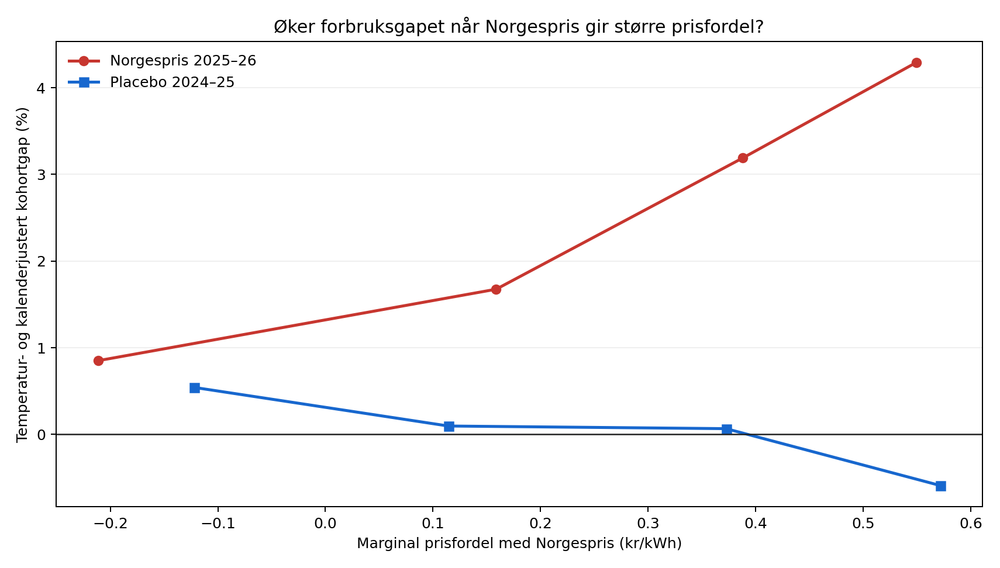

# Norgespris: timevis test med klokkeslett, temperatur og prisinsentiv

**Dato:** 18. september 2026  
**Datavindu:** 1. oktober 2023–30. april 2026  
**Behandlingsvindu:** 1. oktober 2025–30. april 2026  
**Placebovindu:** 1. oktober 2024–30. april 2025

## Konklusjon

Den nye testen styrker en kausal tolkning. Etter kontroll for eksakt time i uken, kalendermåned, områdespesifikk temperatur og kontrollgruppens last øker forbruksgapet mellom tidlige Norgespris-bestillere og ikke-bestillere når den marginale prisfordelen med Norgespris blir større.

- I behandlingsvinteren er helningen **+5,09 log-prosentpoeng per 1 kr/kWh** større prisfordel.
- I placebo-vinteren er den tilsvarende helningen **−1,32 log-prosentpoeng per 1 kr/kWh**.
- Forskjellen er **+6,41 prosentpoeng per 1 kr/kWh**, med uke-blokkbootstrap-intervall **[5,26, 7,82]**. Per 10 øre/kWh tilsvarer dette omtrent **+0,64 prosentpoeng** høyere relativt forbruk.
- Den temperatur- og kalenderjusterte nivåeffekten, etter fratrekk for placebo, er **+2,81 prosent** med intervall **[2,35, 3,26]**.
- Ved den observerte gjennomsnittlige prisfordelen på **34,9 øre/kWh** tilsvarer den estimerte dose–respons-komponenten omtrent **+2,26 prosent**. Det er rundt 80 prosent av nivåeffekten, men skal forstås som en modellbasert dekomponering—ikke som en egen randomisert effekt.

Resultatet er derfor vanskelig å forklare som bare kaldere vær, faste døgnmønstre eller en generell forskjell mellom bestillere og ikke-bestillere. Det viser den mekanismen Norgespris skulle utløse: relativt forbruk øker mest i timene der den marginale strømprisen faktisk reduseres mest.

## Resultater etter prisfordel

| Marginal prisfordel | Behandlingsvinter: justert gap | Placebovinter: justert gap |
|---:|---:|---:|
| ≤ 0 kr/kWh | +0,85 % | +0,54 % |
| 0–0,25 kr/kWh | +1,68 % | +0,10 % |
| 0,25–0,50 kr/kWh | +3,19 % | +0,07 % |
| 0,50–0,75 kr/kWh | +4,29 % | −0,59 % |

Det finnes ingen behandlingsobservasjoner over 0,75 kr/kWh i perioden. Bin-resultatene er deskriptive modellrester; hovedintervallet gjelder den lineære helningsforskjellen.

## Modell

Utfallet er beregnet for hver opprinnelige time og hvert av de ni strataene (NO1, NO2 og NO5 × lavt, middels og høyt årsforbruk):

\[
g_{s,t}=\log(kWh/målepunkt)_{tidlig,s,t}-\log(kWh/målepunkt)_{ikke,s,t}.
\]

En separat førperiode-modell for hvert stratum predikerer dette gapet med:

- faste effekter for **time i uken** (168 kategorier), basert på norsk lokalt klokkeslett;
- faste effekter for **kalendermåned**;
- en kubisk funksjon av **oppvarmingsgrader**, \(\max(0,17-T)\);
- i hovedmodellen en kubisk funksjon av logaritmen til kontrollkohortens timeforbruk.

Testperiodens prediksjonsavvik regresseres deretter på den timevise marginale prisfordelen:

\[
W_{a,t}=P^{strømstøtte}_{a,t}-0{,}40.
\]

Den effektive marginalprisen med ordinær strømstøtte settes lik spotprisen under terskelen og lik terskel + 10 prosent av overskytende spotpris over terskelen. Terskelen er 0,73 kr/kWh i 2024, 0,75 i 2025 og 0,77 i 2026, alle ekskl. merverdiavgift. Norgespris er 0,40 kr/kWh ekskl. merverdiavgift. Regjeringens historikk bekrefter tersklene og timeberegningen, mens NVE beskriver 2026-regelen ([Regjeringen](https://www.regjeringen.no/no/tema/energi/strom/regjeringens-stromtiltak/id2900232/), [NVE](https://www.nve.no/reguleringsmyndigheten/kunde/stroem/dette-er-stroemstoetteordningen/)).

Identifikasjonstesten er forskjellen mellom prishelningen i behandlingsvinteren og samme konstruerte helning i placebo-vinteren. Intervallet er beregnet med 2 000 uavhengige blokkresampling-er av kalenderuker i de to vintrene.

## Robusthet

Når kontrollkohortens last tas helt ut og modellen bare bruker klokkeslett, måned og direkte temperatur, blir helningsforskjellen **+7,10 prosentpoeng per 1 kr/kWh**. Hovedresultatet er altså ikke skapt av kontrollen for ikke-bestillernes last.

Datadekningen er 5 088 timer i hver vinter, ni strata og 45 792 time–stratum-observasjoner i behandlingsperioden. Placeboperioden har seks færre observasjoner på grunn av én manglende pris-time i to prisområder ved klokkeomstillingen i oktober 2024. Spotpriskilden hadde også to motstridende duplikatrader ved samme omstilling; de to parene er gjennomsnittet. Dette gjelder 2 av om lag 30 500 område–timer og har neglisjerbar vekt.

## Datakilder og avgrensninger

- **Forbruk og kohorter:** Elhubs timeaggregerte datasett etter Norgespris-status, prisområde og forbruksgruppe. Kohortstatus er fastsatt etter bestillingstidspunkt, og analysen bruker «Ordered early» mot «Not ordered» ([Elhub-dokumentasjon](https://elhub.atlassian.net/wiki/spaces/Data/pages/2816081922/Forbruk%2Bper%2BNorgespris-status%2Bforbruksgruppe%2Bprisomr%2Bde%2Bog%2Bantall%2Bm%2Blepunker%2Bper%2Btime)).
- **Spotpris:** åpent områdepris-API som videreformidler Nord Pool-priser, ekskl. avgifter ([Hva koster strømmen](https://www.hvakosterstrommen.no/strompris-api)).
- **Temperatur:** timevis 2-meters temperatur fra Open-Meteos historiske reanalyse, gjennomsnitt av tre geografiske punkter per prisområde. Kilden beskriver dataene som gap-frie reanalysedata basert på blant annet ERA5/ERA5-Land og ECMWF IFS ([Open-Meteo Historical Weather API](https://open-meteo.com/en/docs/historical-weather-api)). Dette er en områdeproxy, ikke målt temperatur ved hvert målepunkt.

Testen løser ikke all seleksjon: husholdninger valgte Norgespris selv, og timevise spotpriser er ikke randomisert. Det avgjørende fremskrittet er at permanente kohortforskjeller og felles område–time-sjokk differensieres bort, mens mekanismen testes mot en placebo-vinter. Resultatet bør derfor omtales som **sterk kausal støtte**, ikke som samme bevisnivå som et randomisert forsøk.

## Reproduserbare filer

- `analyze_norgespris_hourly.py`: nedlasting, kobling, modell, bootstrap og figur.
- `norgespris_hourly_results.json`: alle hovedestimater og definisjoner.
- `norgespris_hourly_price_response.csv`: dose–respons-bin.
- `norgespris_hourly_prices.csv`: koblet spotprisserie.
- `norgespris_hourly_temperature.csv`: koblet temperaturserie.
